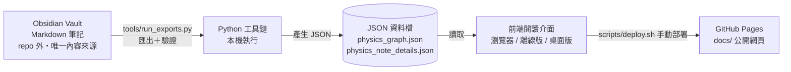

# knowledge-base 架構說明（給非工程師）

> 最後更新：2026/08/06

## 這個專案在做什麼？
這是一套「知識庫生產線」：先用筆記軟體寫好物理／材料科學的教學筆記，再用程式把筆記自動轉成網頁資料，最後在瀏覽器裡以「互動知識圖譜」（節點與連線的地圖）的方式閱讀這些知識。主要使用場景是：自己維護一套大學物理（目前 417 篇筆記）與材料科學的百科式學習筆記，並透過 GitHub Pages 公開網頁或本機網頁瀏覽。

一句話：**把 Markdown 筆記變成看得見的互動知識地圖**。

## 怎麼使用？
分成「讀的人」和「寫的人」兩種用法：

**當讀者（瀏覽網頁）：**
1. 打開公開網頁（GitHub Pages，入口是 `docs/index.html`）。
2. 用「搜尋」框輸入關鍵字（例如「拉格朗日力學」），或直接在圖譜上點選節點。
3. 點節點後右側會出現筆記摘要；點「閱讀模式」可看完整內容（含數學公式）。
4. 用左側分類（領域、類型）篩選想看的主題。

**當作者（本機維護，Windows）：**
1. 在 Obsidian 開啟外部 Vault 資料夾，編輯或新增 Markdown 筆記（要符合 `schema/` 規定的章節結構）。
2. 執行 `python tools\run_exports.py` 重新匯出資料並驗證（有錯會直接報錯停下來）。
3. 執行 `start_prototype.cmd`，瀏覽器會自動開啟本機網頁 `http://127.0.0.1:4173/prototype/` 預覽。
4. 想更新公開網頁時，執行 `scripts/deploy.sh`（會自動匯出 → 同步到 `docs/` → 提交 → 推上 GitHub）。

另外有兩種特殊觀看方式：`standalone_html_app\` 的 `index.html` 可以「雙擊直接開啟」離線版；`desktop_exe_app\` 可打包成 Windows 桌面程式（Electron）。

## 系統由哪些部分組成？
這個專案**沒有傳統的雲端伺服器**，它分成四層：

1. **內容層（資料庫）**：真正的內容存放在 repo「外面」的 **Obsidian Vault**（一個本機資料夾，內含 **Markdown** 純文字筆記檔）。每篇筆記開頭有一段叫 **frontmatter** 的欄位區塊（記錄類型、標題、領域），內文用 **[[wikilink]]** 互相連結、用 `$...$` 寫數學公式。專案文件反覆強調一句原則：「Vault 是唯一權威來源（source of truth）」，所有其他資料都是從它衍生出來的。

2. **工具層（本機後端）**：repo 裡的 `tools\` 資料夾是一批 **Python** 程式（匯出、驗證、生成、品質稽核等），在你自己電腦上執行，把 Vault 的筆記轉成 **JSON** 資料檔（`physics_graph.json` 圖譜資料、`physics_note_details.json` 閱讀資料），並檢查筆記結構與連結有沒有壞。開發時 `start_prototype.ps1` 會用 Python 內建的 `http.server` 在本機開一個小網站伺服器（只綁定 127.0.0.1，外面連不進來）。另外 `tools\review_server.py` 是一個本機審查伺服器，用來在「人工檢查 AI 補寫內容」的工作流中提供網頁介面。

3. **前端層（畫面）**：`prototype\` 是主要閱讀介面，是純 HTML + JavaScript + CSS 寫成的**單頁應用**，沒有框架。它讀取匯出的 JSON 檔，畫出可拖曳縮放的知識圖譜、側邊摘要面板、全頁閱讀模式，並用 **MathJax** 渲染數學公式。其他前端還有 `prototype_semantic_lens\`（新版的焦點透鏡原型）、`standalone_html_app\`（資料內嵌的離線版）、`desktop_exe_app\`（**Electron** 包裝的 Windows 桌面版）、`review_app\`（審查用介面）。

4. **部署層**：`docs\` 資料夾是公開網頁的成品區，由 `scripts/deploy.sh` 把前端與 JSON 複製進去後推上 GitHub，**GitHub Pages** 就直接從 `main` 分支的 `docs\` 資料夾提供網頁（`docs\README.md` 記錄了這個設定）。

另外還有一套「AI 補寫工作流」的輔助資產：`llm_configs\`、`prompts\`、`task_templates\` 存放給 **DeepSeek** 模型用的規則與指令（例如只准修補單一章節、禁止亂掰歷史事實），`tools\` 裡有對應的批次處理腳本。**repo 內未發現任何 API 金鑰或直接呼叫 AI 服務的程式碼**——實際呼叫發生在 repo 之外。

## 資料怎麼流動與儲存？
一條完整的資料流（從改筆記到看到畫面）：

1. 你在 **Obsidian** 修改某篇筆記（例如把「法拉第定律」的推導補完整）。
2. 執行 `tools\run_exports.py`：匯出程式 `export_note_details.py` 掃描整個 Vault，把每篇筆記的標題、frontmatter、章節、公式、連結整理成 `physics_note_details.json`；`export_graph.py` 則把筆記與筆記之間的 wikilink、frontmatter 關係（例如「先備知識→需要」）整理成 `physics_graph.json`（節點 + 連線）。
3. 驗證程式 `validate_knowledge_base.py` 接著檢查：筆記數量與匯出數量是否一致、wikilink 有沒有指向不存在的筆記、`$` 數學符號有沒有成對、標題有沒有重複——有任何一項不合格就直接失敗，不產生半成品。
4. 前端 `prototype\` 讀取這兩個 JSON 檔，把節點畫成圖譜、把內容渲染成可閱讀頁面（公式由 MathJax 即時排版）。
5. 要公開時，`scripts/deploy.sh` 把同樣的 JSON 與前端複製進 `docs\`，`git push` 後 GitHub Pages 更新，任何人打開網址就能看到。

儲存方式總結：**唯一權威儲存 = 外部 Obsidian Vault 的 Markdown 檔**；JSON 是「衍生品」（可隨時重新產生，不該被當成資料庫）。

## 登入與權限（如有）
**無**。沒有登入功能、沒有會員系統。公開網頁（GitHub Pages）任何人可讀；本機預覽只在自己電腦上跑。唯一「權限」是 Git 的推播權限——只有 repo 擁有者能 `git push` 更新公開網頁。

## 怎麼安裝到新裝置？
**A. 本機開發環境（Windows）：**
1. 安裝 Python 3（.knowledge-base.local.example.json 範例用的是 `C:\Python311\python.exe`）。
2. 安裝 Obsidian，並確認外部 Vault 資料夾存在（內容不在 repo 裡，要自己準備或從備份複製）。
3. `git clone https://github.com/brian861114-coder/knowledge-base.git`
4. 把 `.knowledge-base.local.example.json` 複製成 `.knowledge-base.local.json`，填入本機的 Python 路徑與 Vault 路徑（此檔已被 `.gitignore` 排除，不會被傳上 GitHub）。
5. 執行 `start_prototype.cmd` 開啟本機預覽（預設 `http://127.0.0.1:4173/prototype/`；可用環境變數 `KB_PROTOTYPE_PORT` 等覆蓋）。
6. 第一次執行前先跑 `python tools\run_exports.py` 產生 JSON。

**B. 桌面版（Electron）：** 在 `desktop_exe_app\` 執行 `npm install` 後 `npm run build`（用 electron-builder 打包成 Windows portable exe），或 `npm start` 直接跑。資料來自該資料夾內的 `graph-data.js` / `note-details-data.js`（注意：內容更新後需要重新產生這些檔案才會同步）。

**C. 公開網頁部署：** 在 repo 根目錄執行 `scripts/deploy.sh`（bash），它會匯出 → 複製到 `docs\` → commit → push；GitHub Pages 設定為 main 分支的 `/docs`（無 CI 自動化，`.github` 資料夾不存在）。

## 怎麼備份與還原？
**備份對象：**
- **最重要的**：外部 Obsidian Vault（全部 Markdown 筆記）——它不在 repo 內，git 幫不上忙。專案文件**沒有提供任何自動備份機制**（未發現備份腳本、排程或提醒程式）；vault 資料夾名稱含「備份」字樣，但那是路徑名稱，不是備份功能。Vault 內若有 `_bak_` 開頭的資料夾，驗證程式會自動忽略（`tools/kb_paths.py`），表示那可能是手動備份慣例。
- repo 本身：用 GitHub 當備份（clone 的內容含工具鏈、schema、前端與匯出的 JSON）。
- 本機設定 `.knowledge-base.local.json`：含本機路徑，被 git 排除，需自行另存。

**還原方式：** 若 repo 壞了 → 重新 clone。若 JSON 壞了或過期 → 跑 `run_exports.py` 重新產生。若 Vault 遺失 → 只能靠外部備份還原（repo 內無此機制），還原後重新匯出即可。

## 外部依賴清單
| 第三方服務 | 用途 | 免費／付費 | 金鑰或帳密放哪裡 | 如果服務倒了或改價會發生什麼 |
|---|---|---|---|---|
| GitHub（含 GitHub Pages） | 存放 repo、託管公開網頁 | 免費（公開 repo） | 無金鑰在 repo 內（Git 憑證由本機 Git 設定管理） | 網站與原始碼會打不開／無法更新；repo 內容可 clone 回本機繼續用 |
| jsDelivr CDN（MathJax 3） | 網頁上渲染數學公式 | 免費 | 無 | 所有前端（含離線版與桌面版）的數學公式無法顯示；其餘內容正常 |
| Obsidian | 本機編輯 Markdown 筆記（Vault 格式來源） | 免費個人使用 | 無 | 筆記仍是純 Markdown 檔，可用其他編輯器；但既有工作流（frontmatter、wikilink 慣例）需人工維持 |
| Electron / electron-builder | 打包 Windows 桌面版 | 免費開源 | 無 | 桌面版無法建置；瀏覽器版不受影響 |
| Python（標準函式庫） | 匯出／驗證／本機伺服器 | 免費開源 | 無 | 工具鏈與本機預覽無法運作 |
| DeepSeek（模型） | AI 內容修復工作流（llm_configs 提及 deepseek_v4pro 等模型設定） | repo 內未標示費用；實際呼叫程式碼與金鑰**未發現**（在 repo 外） | 未發現（不在 repo 內） | AI 輔助補寫流程停擺；手動維護內容不受影響 |

## 風險提醒
| 風險項目 | 是否適用 | 目前怎麼處理 | 殘留風險 |
|---|---|---|---|
| API 金鑰／密碼外洩 | 否 | 全 repo 掃描未發現任何 API 金鑰、密碼或 .env 檔；`llm_configs\` 只有模型名稱與規則；本機設定檔 `.knowledge-base.local.json` 被 `.gitignore` 排除 | 若未來把 AI 呼叫與金鑰加進 repo 內需重新評估 |
| 資料是否公開 | 是 | repo 為公開 GitHub repo，GitHub Pages 公開給所有人閱讀；內容為物理／材料科學教學筆記 | 任何上傳到 repo 的內容立即公開；不適合放私人或機密資料 |
| 個人資料蒐集 | 否 | 前端無表單、無帳號、無追蹤分析程式碼；內容純為學術筆記 | 無 |
| 備份與還原缺口 | 是 | repo 由 GitHub 保管；JSON 可隨時重新產生 | 唯一內容來源（外部 Vault）在 repo 外且**無自動備份**，Vault 遺失等於知識本體遺失 |
| 金流相關 | 否 | 無任何付費、購物或訂閱功能；主要依賴皆為免費服務 | 無 |
| 資料庫刪除或遷移 | 是 | 有完整驗證工具鏈：匯出數量不一致、壞連結、公式不成對都會**直接失敗停止**（`MAINTENANCE.md` 明言「寧可早停也不靜默漂移」）；文件多次提醒確認 Vault 路徑 | 歷史上有過路徑漂移前例；誤刪 Vault 或改筆記結構後未重新匯出，會造成網站內容過期或壞圖 |
| 部署與網路暴露 | 是 | 公開網頁僅為靜態檔案（無伺服器程式可入侵）；本機開發伺服器只綁定 127.0.0.1（`start_prototype.ps1`）；部署為手動 `deploy.sh`，無 CI | 網站內容由「擁有 Git push 權限的人」全權控制，帳號被盜＝網站內容被改 |
| 日誌含敏感資訊 | 否 | 未發現日誌系統；`review_server.py` 只回傳 JSON 資料，無敏感資料寫入 | 無 |

## 壞了怎麼辦？
按這個順序檢查（依 `MAINTENANCE.md` 的疑難排解章節整理）：

1. **網頁內容是舊的** → 檢查是不是改完筆記忘了跑 `run_exports.py`；本機伺服器有沒有重開；看的資料夾對不對。
2. **圖譜缺節點／連結不對** → 檢查 `physics_graph.json` 有沒有重新匯出；筆記標題改了但 `[[wikilink]]` 沒跟著改；新筆記有沒有放在對的 Vault 資料夾。
3. **公式在 Obsidian 正常、瀏覽器不顯示** → 確認用的是 `$...$`／`$$...$$` 格式；網頁必須經 HTTP 提供（不能用 `file://` 直接開 prototype）；MathJax 有沒有從 CDN 載入成功（需網路）。
4. **圖片不顯示** → 確認圖片語法與路徑（要用 repo 內 `assets\` 的相對路徑，不能寫 Windows 絕對路徑）；重新匯出。
5. **閱讀模式版面壞掉** → 檢查 JSON 有沒有在筆記結構變更後重新匯出；前端 `app.js`／`styles.css` 有沒有被改動。
6. **匯出結果半新半舊** → 先確認 Vault 內容已定稿，再單獨跑匯出，最後才重新整理前端（避免交錯進行）。
7. **開新機器後怪怪的** → 最常見原因是 Vault 路徑設定錯、沒重新匯出、舊 JSON 還在被讀。

**自動糾錯機制：** 沒有自動重啟、沒有監控告警、沒有健康檢查（本機專案＋靜態網站，沒有常駐服務）。最接近「自動防呆」的是驗證工具鏈：`run_exports.py` 每次匯出後強制跑驗證，任何數量不一致、壞連結、公式不成對、標題重複都會讓程式直接失敗退出；`validate_structure.py` 檢查章節順序；`audit_content_quality.py` 檢查內容品質（如「物理意義太短」「相關連結未分組」）。桌面版在資料檔缺失時會顯示明確錯誤訊息而不是白畫面。部署層 `deploy.sh` 若沒有變更會跳過空提交（`No changes to commit`）。

## 架構圖

## 名詞對照表
| 專有名詞 | 白話解釋 |
|---|---|
| Obsidian Vault | 一個本機資料夾，裡面放著所有 Markdown 筆記檔，是本專案真正的「內容資料庫」 |
| Markdown | 一種用簡單符號（如 `#`、`**`）寫文章的純文字格式，任何文字編輯器都能開 |
| frontmatter | 筆記最開頭用 `---` 夾住的欄位區塊，記錄類型、標題、領域等「筆記的身分證」 |
| wikilink | `[[筆記名稱]]` 這種格式的內部連結，點下去可以跳到另一篇筆記 |
| JSON | 一種給程式讀的結構化文字資料格式（有點像「程式界的表格」） |
| schema | 事先定義好的規則，規定「每種筆記該有哪些章節、什麼順序」 |
| validator／驗證器 | 檢查資料有沒有符合規則的程式；有問題就直接報錯 |
| source of truth（唯一權威來源） | 整個系統裡「內容以誰為準」的那一份資料，本專案是外部 Vault |
| GitHub Pages | GitHub 提供的免費靜態網頁託管服務，repo 更新後網站跟著更新 |
| repo（repository） | 程式專案倉庫，用 Git 管理每一版變更 |
| Git | 記錄檔案每一版變更的版本控制系統，本專案用 GitHub 當遠端倉庫 |
| Electron | 一種把網頁程式包裝成 Windows 桌面應用程式的框架 |
| MathJax | 把 `$...$` 數學語法排版成漂亮公式的程式庫 |
| CDN | 把公開程式庫分散在世界各地的加速伺服器（本專案用它載入 MathJax） |
| HTTP／http.server | 瀏覽器與程式溝通的協定／Python 內建的簡單本機網站伺服器 |
| port（連接埠） | 本機伺服器使用的編號（本專案預設 4173），像大樓裡不同房間的門牌 |
| 單頁應用 | 只用一個 HTML 檔案就包含所有畫面的網頁程式 |
| CI | 自動化測試與部署系統；本專案未使用（部署靠手動 script） |
| DeepSeek | AI 模型供應商；本專案的「AI 補寫內容」工作流以它的模型為對象（實際呼叫在 repo 外） |
| prompt | 給 AI 模型的指令文字（本專案把各種限制寫成 prompt 檔） |
| API | 程式之間互相呼叫的「服務窗口」 |
| exe | Windows 可執行檔（本專案桌面版的最終成品） |
| npm | Node.js 生態的套件管理工具，用來安裝桌面版的 Electron 等元件 |
